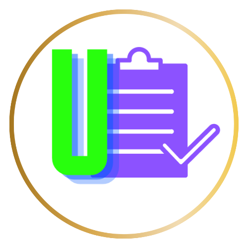

# Colaborar A+ 


- [Descrição](#descrição)
- [Características](#características)
- [Componentes Principais](#componentes-principais)
  - [manifest.json](#manifestjson)
  - [popup.html](#popuphtml)
  - [content.js](#contentjs)
  - [miniwindow.js](#miniwindowjs)
- [Funcionamento](#funcionamento)
- [Testando Localmente](#testando-localmente)
  - [1. Clone o Repositório](#1-clone-o-repositório)
  - [2. Carregar a Extensão no Chrome](#2-carregar-a-extensão-no-chrome)
  - [3. Modificações e Testes](#3-modificações-e-testes)
- [Contribuindo](#contribuindo)
- [Licença](#licença)


## Descrição
"Colaborar A+" é uma extensão do Chrome projetada para alunos da UNOPAR e ANHANGUERA, facilitando a obtenção do calendário de atividades do portal Colaborar PDA. A extensão permite aos usuários gerar relatórios detalhados de suas atividades acadêmicas, incluindo informações sobre disciplinas, somatórios de pontos no AVA, e um calendário de atividades com datas de início e término.

## Características
- Extrai informações do calendário de atividades do Colaborar PDA.
- Apresenta somatórios de pontos por disciplina no AVA.
- Organiza atividades acadêmicas em uma agenda visual.
- Gera relatórios detalhados para impressão ou consulta online.

## Componentes Principais

### manifest.json
Define metadados essenciais da extensão, como sua versão, nome, permissões necessárias, e especifica os arquivos de script e popup HTML.

### popup.html
Fornece a interface do usuário da extensão, incluindo um botão para iniciar o processo de extração de dados e exibição dos resultados. Utiliza `miniwindow.js` para interações do usuário.

### content.js
Responsável pela lógica principal de extração de dados do site Colaborar PDA. Implementa funcionalidades para extrair informações das disciplinas, atividades, e organiza esses dados para posterior apresentação.

### miniwindow.js
Gerencia as ações iniciadas pelo usuário a partir do popup HTML, como iniciar o scraping de dados. Interage com `content.js` para enviar e receber dados, processa as informações recebidas, e atualiza a interface do usuário com os resultados.

## Funcionamento

1. **Início do Processo**: O usuário clica no botão "Gerar Relatório" em `popup.html`, que aciona o evento em `miniwindow.js`.

2. **Envio da Mensagem**: `miniwindow.js` envia uma mensagem para a aba ativa, solicitando o início da extração de dados, que é capturada por `content.js`.

3. **Extração de Dados**: `content.js` extrai as informações necessárias do site, como semestre atual, atividades, pontos por atividade, e organiza esses dados.

4. **Resposta e Apresentação**: Os dados extraídos são enviados de volta para `miniwindow.js`, que processa as informações e atualiza a interface do usuário com um relatório detalhado das atividades e pontos.

5. **Geração de Relatório**: Os dados são apresentados ao usuário de maneira organizada, permitindo uma fácil consulta às atividades e pontuações. Uma opção de impressão do relatório é também fornecida para conveniência do usuário.

## Testando Localmente

Para contribuir com o desenvolvimento desta extensão Chrome, siga os passos abaixo para testá-la localmente:

### 1. Clone o Repositório

Primeiro, clone o repositório do projeto para a sua máquina local usando o Git. Abra o terminal e execute o seguinte comando:

```bash

git clone https://github.com/nivandosoares/unopar_crawlerweb_extension.git
```

### 2. Carregar a Extensão no Chrome

Para carregar sua extensão localmente no Chrome, siga estes passos:

1. Abra o Google Chrome e acesse a página de extensões digitando `chrome://extensions/` na barra de endereços e pressionando Enter.
2. No canto superior direito da página de extensões, ative o modo de desenvolvedor clicando no botão "Modo de desenvolvedor" ou "Developer mode", dependendo da localização do seu navegador.
3. Clique no botão "Carregar sem compactação" ou "Load unpacked", que deve aparecer após ativar o modo de desenvolvedor.
4. Navegue até o diretório onde você clonou o repositório da extensão, selecione a pasta da extensão e clique em "Selecionar pasta" ou "Select folder".

A extensão agora deve estar visível e ativa em seu navegador. Você pode testar as funcionalidades conforme necessário.

### 3. Modificações e Testes

- Após fazer modificações no código, recarregue a extensão através da página `chrome://extensions/` clicando no botão "Atualizar" ou "Reload" da extensão correspondente.
- Para ver os efeitos das suas mudanças, você pode precisar recarregar as páginas do navegador onde a extensão está ativa.

### Contribuindo

Depois de realizar testes locais e verificar que suas modificações estão funcionando como esperado, sinta-se livre para criar um pull request com suas alterações para o repositório principal. Certifique-se de seguir as diretrizes de contribuição fornecidas.

## Licença
[Colaborar A+ ](https://chromewebstore.google.com/detail/colaborar-a+/aigpjgbdkakibodbblbjfnnbgaajkbpn)© 2024 by [Nivando Soares ](https://github.com/nivandosoares)is licensed under [Attribution-NonCommercial 4.0 International](http://creativecommons.org/licenses/by-nc/4.0/?ref=chooser-v1) 